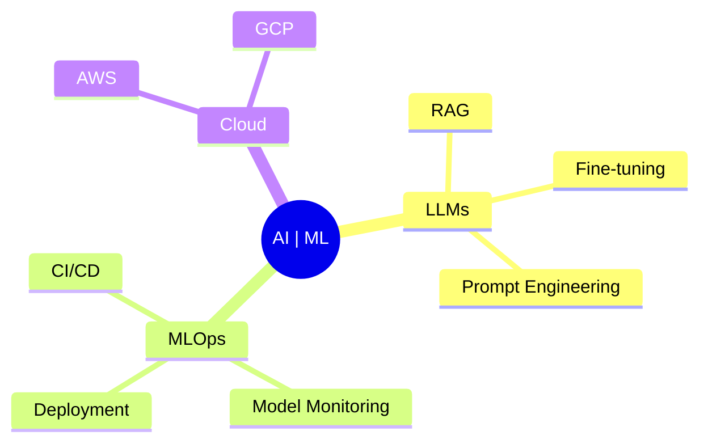

# Hi there, I'm Nishchay! 👋

---

## 🎓 Education & Achievements

- **Georgia State University**, Atlanta, GA  
  🎯 B.S. in Computer Science & Data Science (2025)  
  📊 GPA: 3.92/4.0  
  🏆 President's List (5 consecutive semesters)

- **Certifications**  
  - AWS Solutions Architect Associate
  - Databricks Data Engineering
  - NASA Advanced Computing
  - CodePath iOS, Web Security, and ML

---

## 💻 Technical Arsenal

### Core Technologies

### Infrastructure & Tools

---

## 🚀 Flagship Projects

### 🤖 CareerWide AI
**Revolutionizing Recruitment Through AI**
- 🧠 Advanced LLM integration with Gemini Pro
- 🔄 Real-time job matching algorithm
- 🎯 95% accuracy in candidate-role matching
- 📊 10,000+ daily application processing

### 📈 AI Stock Vision
**Next-Gen Stock Market Intelligence**
- 🤖 Hybrid LSTM-CNN architecture
- 📊 Real-time market sentiment analysis
- 🎯 87% prediction accuracy
- 💹 Portfolio optimization engine

---

## 🌱 Currently ML Learning

---

### "Dream: Solving Asymetric Real World Problems through innovative data driven models." 💡

