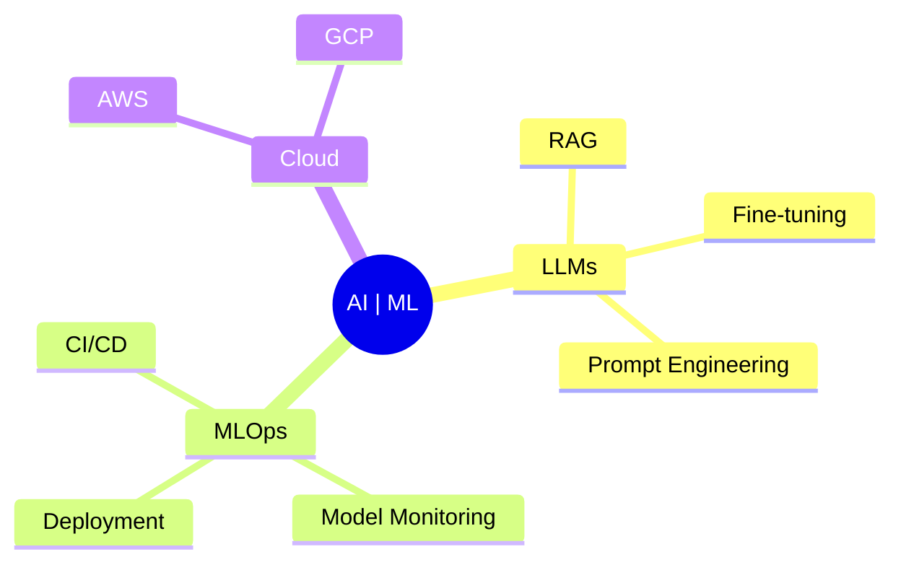

# NISHCHAY PATEL

   

### "Dream: Solving Asymmetric Real World Problems through innovative data driven models." 💡

   

## 🎓 Education & Achievements

- **Georgia State University**, Atlanta, GA  
  🎯 B.S. in Computer Science & Data Science (2025)  
  📊 GPA: 3.92/4.0  
  🏆 President's List (5 consecutive semesters)

- **Certifications**  
  - AWS Solutions Architect Associate
  - Databricks Data Engineering
  - NASA Advanced Computing
  - CodePath iOS, Web Security, and ML

---

## 💻 Technical Arsenal

### Core Technologies

### Frameworks & Libraries

### Infrastructure & Tools

### Additional Expertise

SQL, NoSQL, LangChain, Scrum (Agile), ETL
 
Generative AI, NLP, LLM, Audio Processing

Librosa, IBM Watson, REST API

---

## 🚀 Flagship Projects

### 🤖 CareerWide AI
**Revolutionizing Recruitment Through AI**
- 🧠 Advanced AI integration with Gemini Pro
- 🔄 Real-time job matching algorithm
- 🎯 95% accuracy in candidate-role matching

### 📈 AI Stock Vision
**Next-Gen Stock Market Intelligence**
- 🤖 Hybrid LSTM-CNN architecture for market sentiment analysis
- 📊 Real-time market data
- 🎯 87% prediction accuracy

---

## 🌱 Currently Learning (ML/ AI Focused)

---
